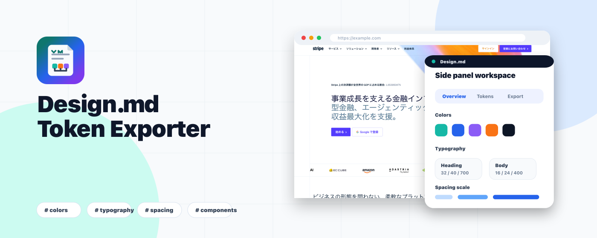
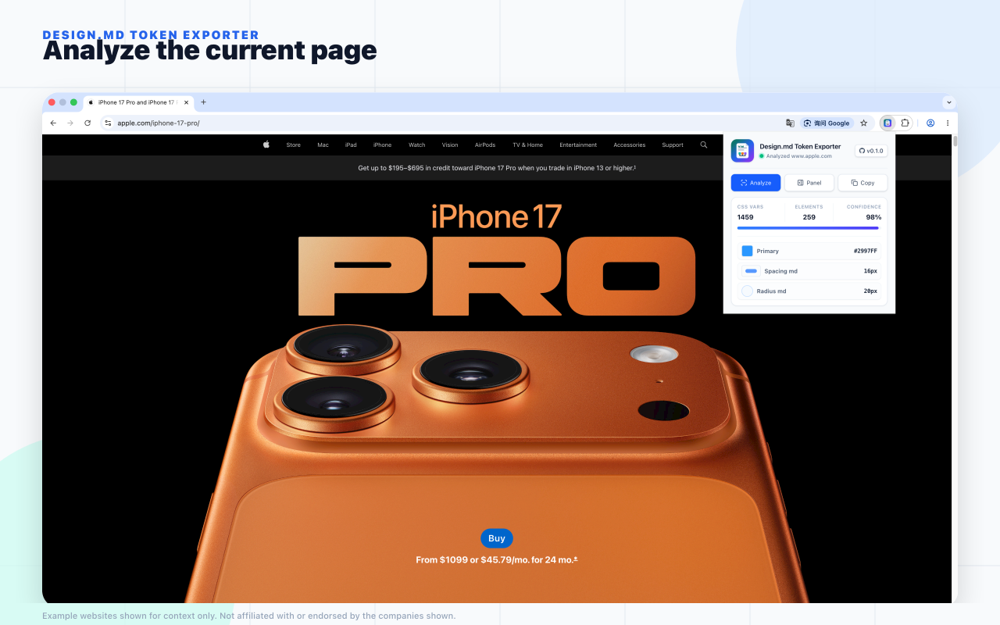
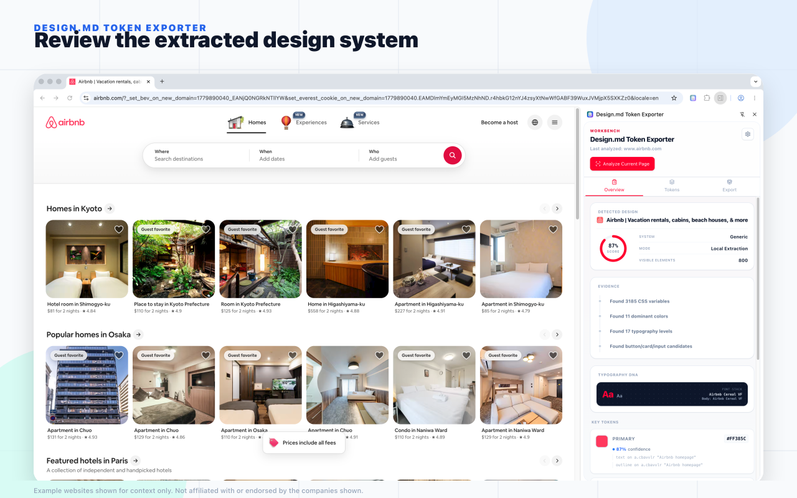
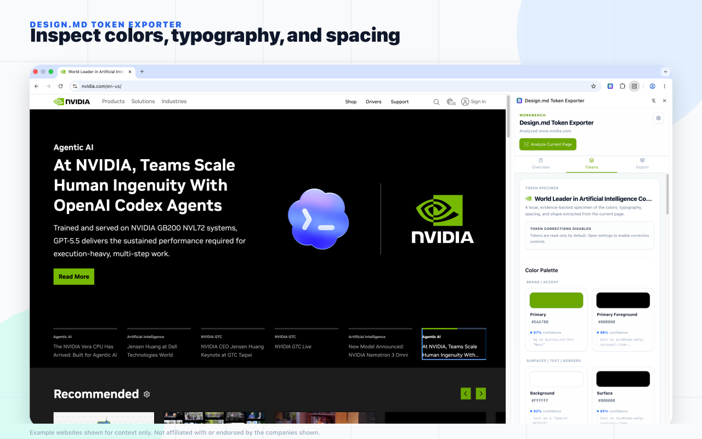
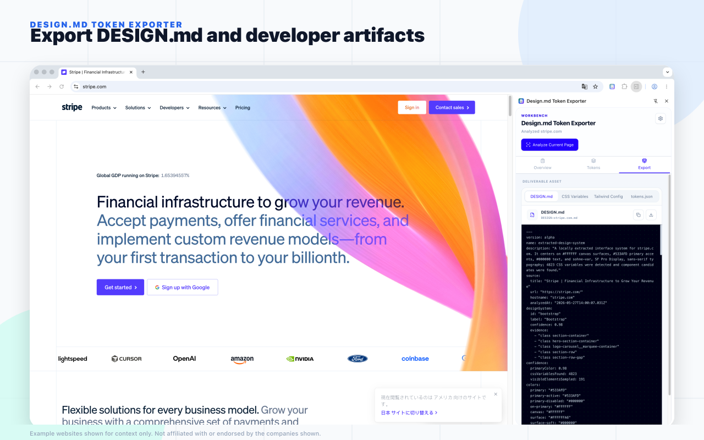

# Design.md Token Exporter

<p align="center">
  <a href="README.md"><strong>English</strong></a>
  ·
  <a href="README.zh-CN.md">简体中文</a>
</p>

<p align="center">
  
  
  
  
  <a href="https://chromewebstore.google.com/detail/designmd-token-exporter/jkeicmodgpdpakcoafcppfhdbeppgnaj">
    
  </a>
</p>

<p align="center">
  <a href="https://chromewebstore.google.com/detail/designmd-token-exporter/jkeicmodgpdpakcoafcppfhdbeppgnaj"><strong>Install from Chrome Web Store</strong></a>
</p>



Local-first Chrome extension for extracting design tokens from the current webpage and exporting AI-friendly design artifacts.

Design.md Token Exporter analyzes the active tab only after an explicit user action, keeps extraction data in the browser, and generates `DESIGN.md`, CSS variables, Tailwind config snippets, and `tokens.json` for frontend implementation workflows.

## Screenshots









## Features

- User-triggered current-page analysis.
- Side Panel workspace for reviewing extracted design tokens.
- Local extraction for colors, typography, spacing, radius, shadows, and basic component styles.
- Optional token correction controls stored locally.
- Export actions for:
  - `DESIGN.md`
  - CSS Variables
  - Tailwind Config
  - `tokens.json`
- Manifest V3 with minimal permissions.
- No AI calls in the MVP.
- No default network requests.

## Privacy And Permissions

The MVP is local-first:

- It does not collect browsing history.
- It does not upload page HTML, CSS, DOM, screenshots, browsing history, or extracted design data.
- It does not call AI or model APIs.
- It does not request `<all_urls>`.
- It does not request `webRequest`, `cookies`, `history`, `downloads`, or broad `tabs` permissions.

Requested Chrome permissions:

- `activeTab`: temporarily access the current tab after the user starts analysis.
- `scripting`: inject the bundled local analyzer after user action.
- `storage`: store the last local extraction result, user corrections, and workspace preferences.
- `sidePanel`: provide the main review and export workspace.

See the published [privacy statement](docs/publish/privacy-statement.md).

## Development

Requirements:

- Node.js compatible with the current WXT/Vite toolchain.
- pnpm.

Install dependencies:

```bash
pnpm install
```

Start the WXT development server:

```bash
pnpm dev
```

Run checks:

```bash
pnpm typecheck
pnpm test
pnpm build
```

## Release Package

Run the full release check:

```bash
pnpm release:check
```

Create the Chrome MV3 upload zip:

```bash
pnpm release:zip
```

The zip is written to:

```txt
.output/design-md-token-exporter-0.1.1-chrome-mv3.zip
```

Before uploading to the Chrome Web Store, verify the zip contains `manifest.json` at the root:

```bash
unzip -l .output/design-md-token-exporter-0.1.1-chrome-mv3.zip | head
```

## Chrome Web Store Status

Design.md Token Exporter is published on the [Chrome Web Store](https://chromewebstore.google.com/detail/designmd-token-exporter/jkeicmodgpdpakcoafcppfhdbeppgnaj).

## Repository Notes

The old prototype under `references/old-prototype` is reference-only. Its source is ignored for public repository publishing unless explicitly reviewed for licensing and privacy.

## Disclaimer

Example website screenshots are used only to demonstrate design-token extraction contexts. This project is not affiliated with or endorsed by Apple, Airbnb, NVIDIA, Stripe, Google, or Stitch.

## License

MIT
